# Bench checks gate every Starling 2 Max modification

Four of your five workstreams are blocked on measurements nobody can make from documentation, and the research turned up four places where your own repo or the framing of the question is factually wrong — starting with the product name. **The aircraft is a ModalAI "Starling 2 Max" (airframe code D0012), not a "Starling Max 2"** ([ModalAI docs](https://docs.modalai.com/starling-2-max-datasheet/)), and searching the transposed name is itself a sourcing trap. The difference between your two airframes is almost certainly **not** a compute-board change but a **WiFi daughterboard accessory swap** on an otherwise identical full-size VOXL 2 ([forum.modalai.com post 25386](https://forum.modalai.com/post/25386)), which `voxl-version` will confirm in one command. Your LED daemon's comment naming ESC "M0138" conflicts with ModalAI's own statement that the Starling 2 Max ESC is **M0129-5 or M0129-65** ([ModalAI forum](https://forum.modalai.com/topic/4334/starling-2-max-main-voltage/3)); one of them is wrong and only the silkscreen settles it. And the biggest reframe: **LiDAR → `vdb_mapping` → global planning is already the default, already-CI-tested path in the AirStack branch you fly** — it is not new work. What *is* new work is LiDAR → pose, and there the honest answer is that a Livox Mid-360 consumes essentially your entire published payload budget, leaves no room for a companion computer, and nobody on earth has publicly flown one on a VOXL 2.

## Four framing errors worth correcting before you order anything

The naming error is the cheapest to fix and the most expensive to leave alone. ModalAI publishes a "Starling 2 Max Datasheet" (D0012) and a separate "Starling 2 Datasheet" for a smaller 230 mm-diagonal aircraft (D0014) ([ModalAI docs](https://docs.modalai.com/starling-2-max-datasheet/); [ModalAI docs](https://docs.modalai.com/starling-2-datasheet/)), and there is a third, much older "Starling" running **1504 motors and 120 mm propellers** ([ModalAI store](https://www.modalai.com/products/starling-replacement-motors)). A customer with four Starling 2 Max drones bought Sentinel propellers (MPR-D0006-1-01) in September 2025 and they did not fit ([forum.modalai.com post 23859](https://forum.modalai.com/post/23859)). Order by MPN via direct link, never by store search.

The second correction concerns your two airframes. You describe one as having an integrated WiFi board and one a USB dongle, and it is tempting to read that as two generations of compute board. ModalAI's own feature matrix says **built-in WiFi: No for both VOXL 2 and VOXL 2 Mini** ([ModalAI docs](https://docs.modalai.com/voxl2-mini-feature-matrix/)); the VOXL 2 "by itself doesn't have Wi-Fi or a LAN port to keep the core size and weight low" ([ModalAI beta docs](https://beta-docs.modalai.com/voxl2-wifidongle-user-guide)). A buyer who owned both vintages reported that a newly-received Starling 2 Max shipped with "a new ELRS receiver (M0184) and a Wi-Fi adapter board built around the Sparrow LGA Long Range Wi-Fi Module", as opposed to older units that came with the **USB3.0/UART Expansion Adapter (M0151) with an Alfa AWUS036EACS and ELRS Nano RX** ([forum.modalai.com post 25386](https://forum.modalai.com/post/25386)). That daughterboard is the **M0213 VOXL 2 WiFi Addon**, built on the Bots Unlimited SP-01-100 "Sparrow" 22×22 mm LGA module, dual-band 802.11ac 2×2 MIMO, mating to the VOXL 2's 60-pin legacy B2B at J1 ([ModalAI docs](https://docs.modalai.com/m0213/)). It replaces an earlier M0141 board, per ModalAI staff ([forum.modalai.com thread 5309](https://forum.modalai.com/topic/5309/m0213-wifi-board-pinout-and-availability.md)) — so there may be *three* WiFi generations in the field, and your newer unit could carry either. Practical consequence: this is an accessory difference, your spares and procedures are shared across both aircraft, and the only genuinely non-interchangeable split is the airframe revision (below), not the compute board.

The third is the ESC part-number conflict in your own code. `svg_led_daemon.py` line 62 asserts the strip is driven on M0138; ModalAI says M0129-5/-65 ([ModalAI forum](https://forum.modalai.com/topic/4334/starling-2-max-main-voltage/3)). Both cannot be right, and the answer changes which datasheet governs your LED rail voltage — the full-size Modal ESC's AUX is **5.0 V, 500 mA** while the VOXL Mini ESC's is **3.3 V default, 500 mA, with the 5 V select GPIO documented as "(disabled)"** ([ModalAI Modal ESC datasheet](https://docs.modalai.com/modal-esc-datasheet); [ModalAI VOXL Mini ESC datasheet](https://docs.modalai.com/voxl-mini-esc-datasheet/)). That single fact decides whether you need a level shifter and a separate BEC, or neither.

The fourth is the LiDAR framing, and it is the most valuable. Your own vendored tree already contains a complete LiDAR path: `global_bringup/config/vdb_params.yaml` reads `sources: [lidar]`, `topic: sensors/ouster/point_cloud`, `sensor_origin_frame: ouster`, with the stereo source commented out. Upstream states the same in prose — "the VDB map takes the filtered LiDAR cloud" ([adding_a_world_model_and_planner.md](https://raw.githubusercontent.com/castacks/AirStack/main/docs/robot/autonomy/adding_a_world_model_and_planner.md)) — and the path is CI-tested (`tests/conftest.py` sets `ENABLE_LIDAR=true`). The exploration planner is a second consumer. Any plan that treats "get LiDAR into AirStack's map" as the hard part is solving a solved problem; the unsolved parts are LiDAR-derived *pose* and LiDAR-driven *local* avoidance.

## How it ties together

Three pictures, each drawn from your own tree plus ModalAI's documentation. The hardware sections below also carry ModalAI's and Livox's own drawings as primary reference — those images are reproduced from the vendors' public documentation for internal engineering use, each captioned with a link to the page it came from, and copied locally so they still render in the hangar with the WAN unplugged. The first is the aircraft and the four places these workstreams touch it; the second is the control path that flies today; the third is what the LiDAR goal actually changes. GitHub renders these natively — in a terminal pager they appear as code blocks.

### The aircraft, and the four places you are modifying it

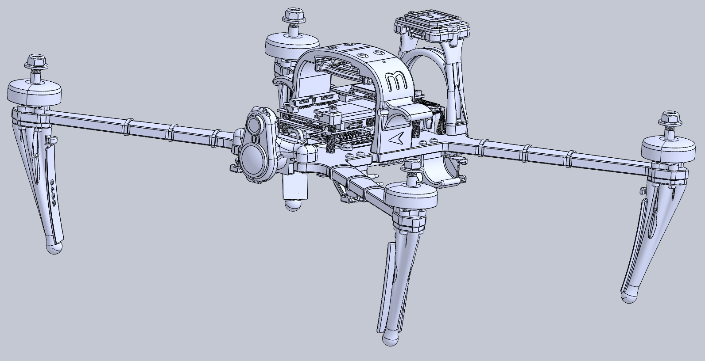

***The airframe.** ModalAI CAD render of a Starling 2 Max V3 (SKU `MRB-D0012-4-V3-C28-M36-T7-K0`) — ModalAI/Livox documentation, retrieved 2026-10-09. Source: <https://forum.modalai.com/topic/5052/starling-2-max-cad (ModalAI staff post #25481, accompanying the STEP file at developer.modalai.com/asset/6)>*

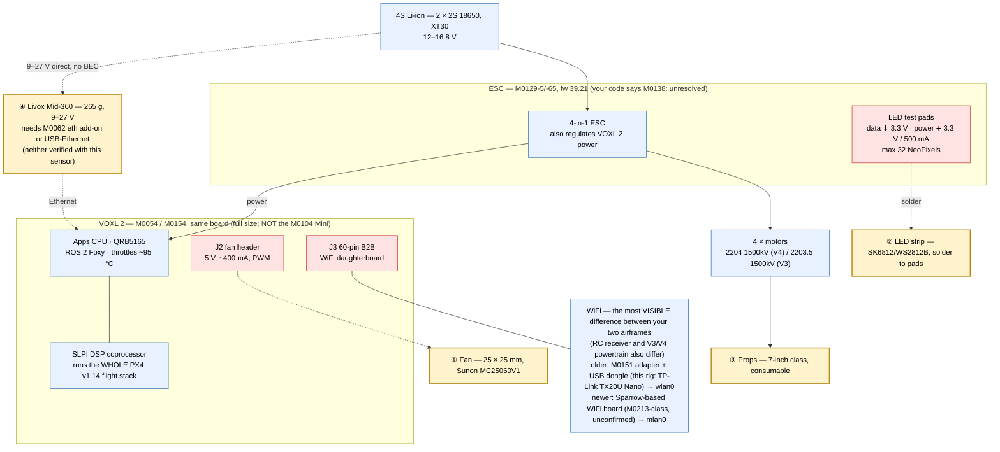
```mermaid
flowchart TB
    BAT["4S Li-ion — 2 × 2S 18650, XT30<br/>12–16.8 V"]

    subgraph ESCB["ESC — M0129-5/-65, fw 39.21 (your code says M0138: unresolved)"]
      ESC["4-in-1 ESC<br/>also regulates VOXL 2 power"]
      LEDPAD["LED test pads<br/>data ⬇ 3.3 V · power ➕ 3.3 V / 500 mA<br/>max 32 NeoPixels"]
    end

    subgraph VOXLB["VOXL 2 — M0054 / M0154, same board (full size; NOT the M0104 Mini)"]
      APPS["Apps CPU · QRB5165<br/>ROS 2 Foxy · throttles ~95 °C"]
      SLPI["SLPI DSP coprocessor<br/>runs the WHOLE PX4 v1.14 flight stack"]
      J2["J2 fan header<br/>5 V, ~400 mA, PWM"]
      J3["J3 60-pin B2B<br/>WiFi daughterboard"]
    end

    WIFI["WiFi — the most VISIBLE difference between your two airframes<br/>(RC receiver and V3/V4 powertrain also differ)<br/>older: M0151 adapter + USB dongle (this rig: TP-Link TX20U Nano) → wlan0<br/>newer: Sparrow-based WiFi board (M0213-class, unconfirmed) → mlan0"]
    MOTORS["4 × motors<br/>2204 1500kV (V4) / 2203.5 1500kV (V3)"]

    FAN["① Fan — 25 × 25 mm, Sunon MC25060V1"]
    PROPS["③ Props — 7-inch class, consumable"]
    STRIP["② LED strip — SK6812/WS2812B, solder to pads"]
    LIDAR["④ Livox Mid-360 — 265 g, 9–27 V<br/>needs M0062 eth add-on or USB-Ethernet<br/>(neither verified with this sensor)"]

    BAT --> ESC
    BAT -.->|"9–27 V direct, no BEC"| LIDAR
    ESC --> MOTORS --> PROPS
    ESC -->|"power"| APPS
    LEDPAD -.->|"solder"| STRIP
    J2 -.-> FAN
    J3 --- WIFI
    APPS --- SLPI
    LIDAR -.->|"Ethernet"| APPS

    classDef mod fill:#fff3cd,stroke:#b8860b,stroke-width:2px,color:#000
    classDef hw fill:#e7f1ff,stroke:#2b6cb0,color:#000
    classDef warn fill:#ffe3e3,stroke:#c53030,color:#000
    class FAN,STRIP,LIDAR,PROPS mod
    class BAT,ESC,APPS,SLPI,MOTORS,WIFI hw
    class LEDPAD,J2,J3 warn
```

The numbered boxes are your four workstreams. Note what the diagram makes obvious and prose hides: **the ESC that would power your LED strip is also VOXL 2's power source**, which is why a full-white strip command is a flight-controller brown-out risk and not merely a bright light.

### The control path that flies today

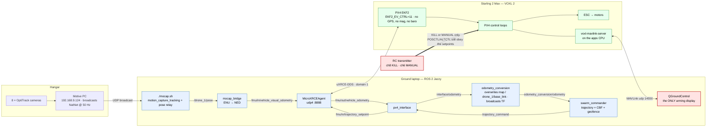
```mermaid
flowchart LR
    subgraph HANGAR["Hangar"]
      CAMS["8 × OptiTrack cameras"] --> MOTIVE["Motive PC<br/>192.168.9.124 · broadcasts NatNet @ 50 Hz"]
    end

    subgraph LAPTOP["Ground laptop — ROS 2 Jazzy"]
      BRIDGE["./mocap.sh<br/>motion_capture_tracking + pose relay"]
      MB["mocap_bridge<br/>ENU → NED"]
      OC["odometry_conversion<br/>overwrites map / drone_1/base_link · broadcasts TF"]
      CMD["swarm_commander<br/>trajectory + CBF + geofence"]
      PXI["px4_interface"]
      AGENT["MicroXRCEAgent<br/>udp4 :8888"]
      QGC["QGroundControl<br/>the ONLY arming display"]
    end

    subgraph DRONE["Starling 2 Max — VOXL 2"]
      EKF["PX4 EKF2<br/>EKF2_EV_CTRL=11 · no GPS, no mag, no baro"]
      CTRL["PX4 control loops"]
      ESCD["ESC → motors"]
      MAVSRV["voxl-mavlink-server<br/>on the apps CPU"]
    end

    RC["RC transmitter<br/>ch8 KILL · ch6 MANUAL"]

    MOTIVE -->|"UDP broadcast"| BRIDGE
    BRIDGE -->|"/drone_1/pose"| MB
    MB -->|"fmu/in/vehicle_visual_odometry"| AGENT
    AGENT <-->|"uXRCE-DDS · domain 1"| EKF
    AGENT -->|"fmu/out/vehicle_odometry"| PXI
    PXI -->|"interface/odometry"| OC
    OC -->|"odometry_conversion/odometry"| CMD
    CMD -->|"trajectory_command"| PXI
    PXI -->|"fmu/in/trajectory_setpoint"| AGENT
    EKF --> CTRL --> ESCD
    CTRL --- MAVSRV
    MAVSRV <-->|"MAVLink udp 14550"| QGC
    RC ==>|"KILL or MANUAL only<br/>POSCTL/ALTCTL still obey the setpoints"| CTRL

    classDef gnd fill:#e7f1ff,stroke:#2b6cb0,color:#000
    classDef air fill:#e6ffed,stroke:#22863a,color:#000
    classDef safety fill:#ffe3e3,stroke:#c53030,stroke-width:2px,color:#000
    class BRIDGE,MB,OC,CMD,PXI,AGENT gnd
    class EKF,CTRL,ESCD,MAVSRV air
    class RC,QGC safety
```

Two things worth reading off this. The mocap pose enters **PX4's estimator**, not AirStack's graph — which is why the drone can hold position at all. And the pose AirStack plans against comes back *out* of PX4 as `fmu/out/vehicle_odometry`, through `odometry_conversion`. Those are two separate seams, and the LiDAR goal has to fill both.

### What the LiDAR goal actually changes

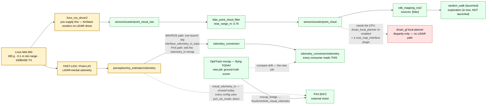
```mermaid
flowchart LR
    LIVOX["Livox Mid-360<br/>265 g · 0.1 m min range · 100BASE-TX"]
    DRV["livox_ros_driver2<br/>you supply this — AirStack vendors no LiDAR driver"]
    RAW["sensors/ouster/point_cloud_raw"]
    FILT["lidar_point_cloud_filter<br/>near_range_m: 0.75"]
    CLEAN["sensors/ouster/point_cloud"]
    VDB["vdb_mapping_ros2<br/>sources: [lidar]"]
    GLOBAL["random_walk (launched)<br/>exploration (in tree, NOT launched)"]

    LIO["FAST-LIO2 / Point-LIO<br/>LiDAR-inertial odometry"]
    EST["perception/my_estimator/odometry"]
    OC2["odometry_conversion"]
    CANON["odometry_conversion/odometry<br/>every consumer reads THIS"]
    EKF2["PX4 EKF2<br/>external vision"]
    MOCAP["OptiTrack mocap — flying TODAY<br/>new job: ground-truth scorer"]
    DROAN["droan_gl local planner<br/>disparity-only — no LiDAR path"]

    LIVOX --> DRV --> RAW --> FILT --> CLEAN --> VDB --> GLOBAL
    LIVOX --> LIO --> EST
    EST -->|"MAVROS path: one launch arg<br/>interface_odometry_in_topic<br/>PX4 path: edit the odometry_in remap"| OC2 --> CANON
    EST -.->|"visual_odometry_in — unused today:<br/>every config uses px4_vio_mode: direct"| EKF2
    MOCAP -->|"mocap_bridge → fmu/in/vehicle_visual_odometry"| EKF2
    MOCAP -.->|"compare drift — the new job"| CANON
    CLEAN -.->|"needs the CPU droan_local_planner re-enabled<br/>+ a cost_map_interface plugin"| DROAN

    classDef exists fill:#e6ffed,stroke:#22863a,color:#000
    classDef newwork fill:#fff3cd,stroke:#b8860b,stroke-width:2px,color:#000
    classDef gap fill:#ffe3e3,stroke:#c53030,color:#000
    class RAW,FILT,CLEAN,VDB,GLOBAL,OC2,CANON,EKF2 exists
    class LIVOX,DRV,LIO,EST newwork
    class DROAN gap
    class MOCAP exists
```

Green already exists in your tree — though only the LiDAR filter chain is CI-tested, and only under Isaac Sim. Amber is what you would build. Red is unsolved: `droan_gl` has no LiDAR path at all, and mocap's role changes from *the position source* to *the independent scorer* — which is the single most useful reframe in this report.

## `voxl-version` and a screwdriver separate the two airframes

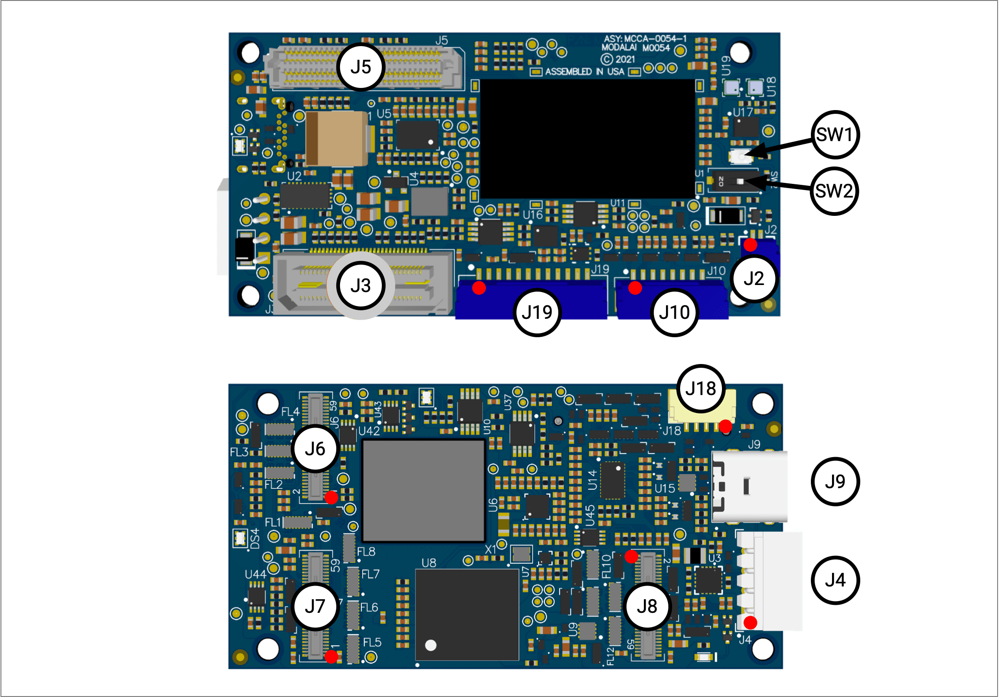

***Where J2 and J3 physically are.** VOXL 2 (M0054) top and bottom with every connector called out. J2 — the 5 V fan header — is at the far right of the top view, just right of J10. J3, the 60-pin board-to-board socket the WiFi add-on bolts to, is the large grey connector at bottom-left. Red dots mark pin 1 — ModalAI/Livox documentation, retrieved 2026-10-09. Source: <https://docs.modalai.com/voxl2-connectors/>*

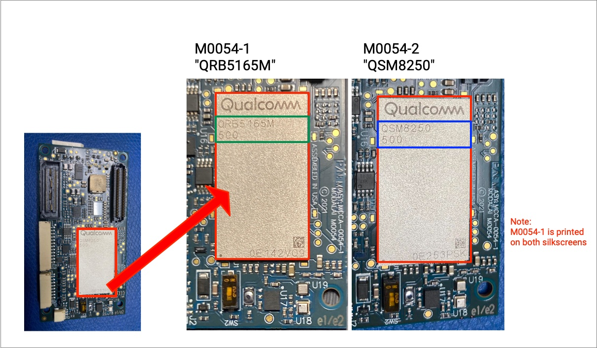

***The variant check the silkscreen can't give you.** The board is printed `M0054-1` on *both* variants; only the Qualcomm SIP cover distinguishes them — `QRB5165M` is the -1, `QSM8250` the -2 (capped at 4 concurrent cameras). Cross-check against `mach.var` from `voxl-version`: 1.0 = -1, 1.2 = -2 — ModalAI/Livox documentation, retrieved 2026-10-09. Source: <https://docs.modalai.com/m0054-versions/>*

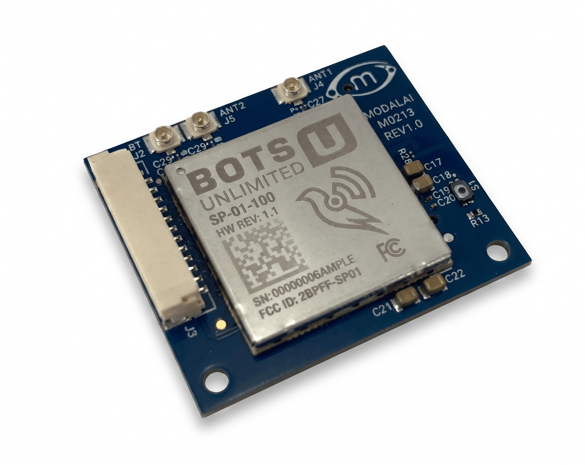

***Your newer airframe's WiFi.** The M0213 add-on carrying the Bots Unlimited SP-01-100 'Sparrow' LGA module (FCC ID 2BPFF-SP01) — a daughterboard on J3, *not* WiFi integrated into the VOXL 2 silicon — ModalAI/Livox documentation, retrieved 2026-10-09. Source: <https://www.modalai.com/collections/add-ons/products/m0141>*

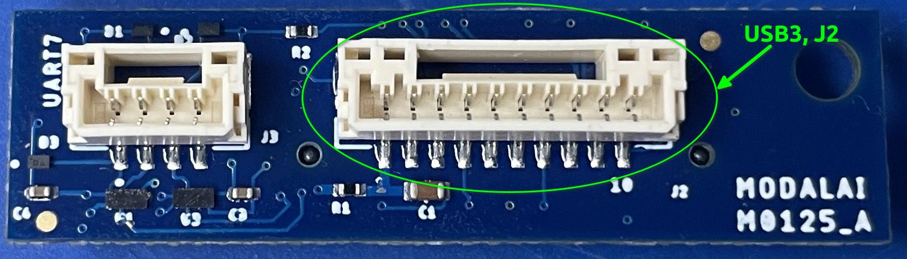

***Your older airframe's path.** The USB3/UART expansion adapter — note the silkscreen reads `MODALAI M0125_A` although it is sold as M0151 — which carries the USB WiFi dongle that comes up as `wlan0` — ModalAI/Livox documentation, retrieved 2026-10-09. Source: <https://docs.modalai.com/voxl2-usb3-uart-add-on-user-guide/>*

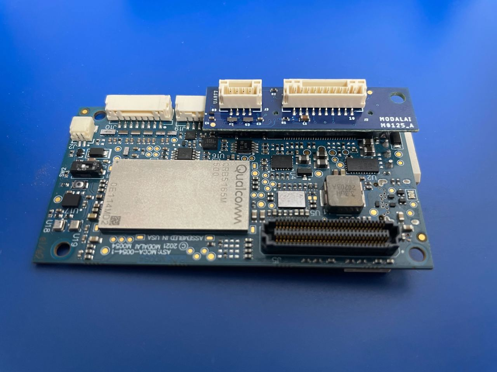

*The same adapter mounted on a VOXL 2, showing the stack-up — ModalAI/Livox documentation, retrieved 2026-10-09. Source: <https://docs.modalai.com/voxl2-usb3-uart-add-on-datasheet/>*

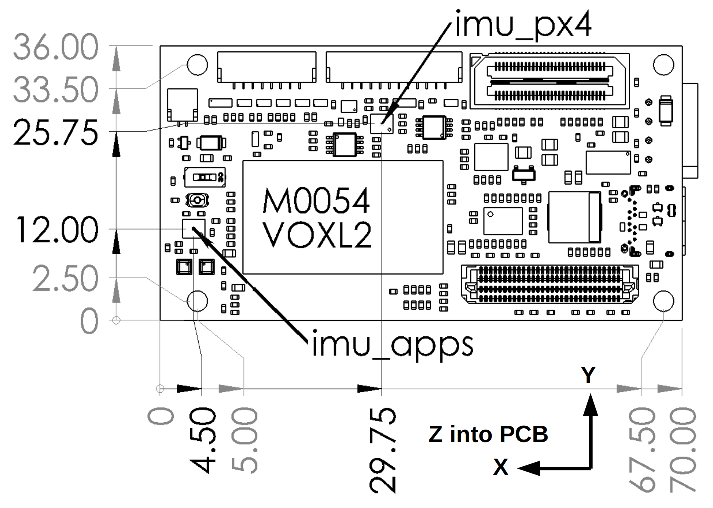

***Board frame and IMU placement.** 70.0 × 36.0 mm, mounting holes at 5.00/67.50 × 2.50/33.50 mm, with `imu_px4` at (29.75, 25.75) and `imu_apps` at (4.50, 12.00). The axis convention — X left, Y up, **Z into the PCB** — is what you reconcile any external pose source against — ModalAI/Livox documentation, retrieved 2026-10-09. Source: <https://docs.modalai.com/voxl2-mechanical-drawings/>*

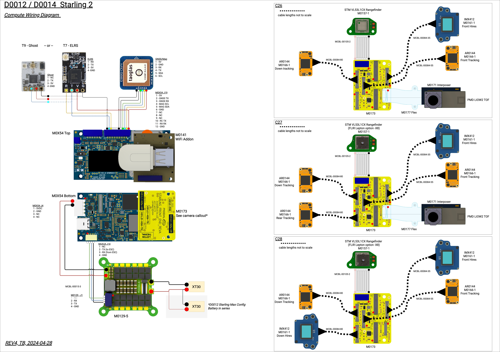

***How it is all wired.** ModalAI's own D0012/D0014 compute wiring diagram (REV4), including the D0012 dual-battery-in-series arrangement — ModalAI/Livox documentation, retrieved 2026-10-09. Source: <https://docs.modalai.com/voxl2-d0014/ — the page the Starling 2 Max datasheet links to from its "Hardware Wiring Diagram" section (https://docs.modalai.com/starling-2-max-datasheet/#hardware-wiring-diagram)>*

Board identification gates everything else, and it costs one command. `voxl-version` prints `hw platform:` (M0054 / M0154 / M0104), `mach.var:` (the dash revision) and `SKU:` (the full airframe config string), and `-j` emits JSON ([ModalAI docs](https://docs.modalai.com/voxl-version/)). The part-number map is unambiguous: **M0054 = original full-size VOXL 2, M0154 = refreshed full-size VOXL 2, M0104/M0204 = VOXL 2 Mini**. ModalAI states "M0054-1 and M0154-1 are functionally equivalent; M0154-1 refreshes some non-logic EOL components", and that `-2` assemblies "only support up to 4 cameras concurrently" ([ModalAI VOXL 2 product page](https://www.modalai.com/products/voxl-2)). The Starling 2 Max datasheet's critical-components table names the flight controller as **"VOXL 2, M0154"** ([ModalAI docs](https://docs.modalai.com/starling-2-max-datasheet/)) — so a newer unit plausibly reports M0154 and your `m0054`-tagged unit reports M0054, but **no source maps a board part number to an airframe revision**; that is inference. Neither aircraft should be a Mini. The dash revision is also readable physically: the SIP cover silkscreen reads **"QRB5165M" for M0054-1 and "QSM8250" for M0054-2**, with `mach.var` 1.0 and 1.2 respectively ([ModalAI docs](https://docs.modalai.com/m0054-versions/)). The same data is in sysfs at `/sys/module/voxl_platform_mod/parameters/machine` and `.../variant`.

The WiFi side is decided by `ip -br link` plus `lsusb` plus `dmesg`. A Realtek RTL8852BU in `lsusb` alongside `wlan0` means the USB-dongle airframe; `mlan0` with nothing matching in `lsusb` means the B2B daughterboard. **No ModalAI source anywhere uses the interface name `mlan0`** — every doc and forum post says `wlan0` — so treat your observation as ground truth and the docs as behind. `mlan0`/`uap0` is the canonical naming of the NXP/Marvell `mwifiex`/`moal` driver family, which combined with "802.11ac 2×2 MIMO + Bluetooth 5.3 in a 22×22 mm LGA" suggests Sparrow wraps an NXP 88W-series combo chip; **this is an inference from driver-naming convention only, with no datasheet or teardown to confirm it.** One command settles it: `readlink /sys/class/net/mlan0/device/driver`. Note also that some SKUs ship with no WiFi at all — a `MRB-D0012-4-V2-C28-T8-M11-X0` owner found a Microhard modem instead ([forum.modalai.com thread 5246](https://forum.modalai.com/topic/5246/starling-2-max-not-detecting-wifi-hardware.md)).

The revision difference that actually costs money is mechanical, and `voxl-version` will not tell you about it. ModalAI's replacement-parts page states that the V1–V3 carbon frame (M10000929, T-Motor powertrain, **black-and-gold 2203.5 1500 kV** motors) and the V4 frame (M10001459, wider motor-mount spacing, **black 2204 1500 kV** motors) are **"not interchangeable"** ([ModalAI store](https://www.modalai.com/products/starling-2-max-replacement-parts)). Both frames are US$249.99 and both motors US$49.99. If your two aircraft straddle that boundary you must stock two frame SKUs and two motor SKUs — a real budget consequence of having bought at different times. Look at motor colour and mount spacing; that is the fastest discriminator. There is no ModalAI serial-number lookup tool and no public changelog of Starling 2 Max revisions, so for a definitive answer on a specific airframe, email ModalAI support with the serial, which is what staff repeatedly tell forum users to do.

## The LED strip is a soldering job onto a 3.3 V test point

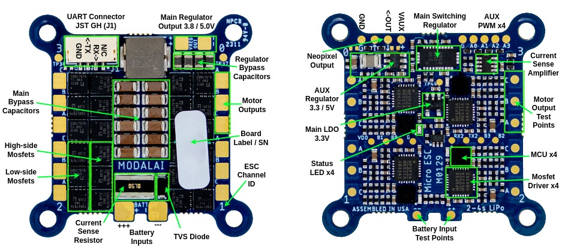

***This settles the M0138-vs-M0129 question — look at the silkscreen.** The VOXL Mini 4-in-1 ESC reads `Micro ESC M0129`, and the bottom side (right) carries an explicit **Neopixel Output** callout beside the GND / ←OUT / VAUX pads, with the **AUX Regulator 3.3 / 5 V** immediately below it. This is the pad you solder to — ModalAI/Livox documentation, retrieved 2026-10-09. Source: <https://docs.modalai.com/voxl-mini-esc-datasheet/>*

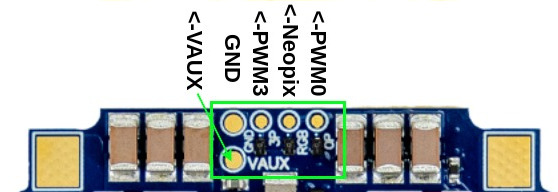

***The other candidate.** If your airframe instead carries the full-size M0138 Racing ESC — the part your `svg_led_daemon.py:62` comment names — the Neopix data pad sits in this group alongside PWM0/PWM3, GND and VAUX — ModalAI/Livox documentation, retrieved 2026-10-09. Source: <https://docs.modalai.com/voxl-fpv-esc-datasheet/>*

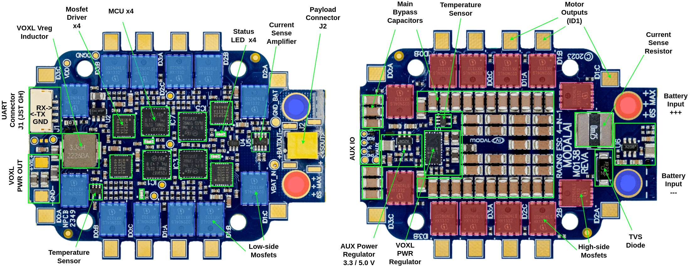

*The full M0138 board, annotated, for locating that pad group — ModalAI/Livox documentation, retrieved 2026-10-09. Source: <https://docs.modalai.com/voxl-fpv-esc-datasheet/>*

Your software is done; the hardware is not plug-in. On the VOXL Mini ESC the NeoPixel output is a bare **solder test point** marked ⬇, carrying a single-wire 3.3 V signal straight off ESC ID0, MCU pin PB6, with **no level shifter on board**; a second test point marked ➕ supplies the LED array, and the AUX regulator is "3.3 V or 5.0 V at 500 mA, **defaulting to 3.3 V**, software-controlled" with the `AUX_VREG_ADJUST` GPIO marked "(disabled)" ([ModalAI VOXL Mini ESC datasheet](https://docs.modalai.com/voxl-mini-esc-datasheet/)). ModalAI staff put the rail's real capability at "500-600 mA" and confirm the 5 V control feature "is disabled at the moment" ([ModalAI forum](https://forum.modalai.com/topic/3702/neopixel-gpio-control-on-voxl2-spi-port)). Expect to tack a three-wire pigtail onto the ESC PCB and strain-relieve it; there is no documented connector option.

The 3.3 V rail is a blessing disguised as a limitation. WS2812B/SK6812 parts want **VIH ≥ 0.7 × VDD**, which is ~3.5 V on a 5 V strip — above what the ESC can drive, and an SK6812 RGBW spec sheet lists **VIH 3.4 V minimum at VDD = 5.0 V** ([OPSCO SK6812 datasheet](https://wmsc.lcsc.com/wmsc/upload/file/pdf/v2/lcsc/2306280930_OPSCO-Optoelectronics-SK6812RGBP8_C7423115.pdf); [Ledyi SK6812 RGBW specification](https://www.ledyilighting.com/wp-content/uploads/2022/02/SK6812-RGBW-LED-specification.pdf)). Adafruit's documented remedies are exactly two: "lower the pixel supply voltage closer to the microcontroller's level… or use a logic level shifter" ([Adafruit NeoPixel Überguide](https://learn.adafruit.com/adafruit-neopixel-uberguide/powering-neopixels)). Running the strip from the ESC's own 3.3 V pad takes option one for free — VIH drops to ~2.3 V, no shifter, no extra parts, no extra weight, at the cost of a visibly dimmer and warm-shifted strip. For an indoor mocap lab that is actively desirable, because dimmer pixels leak less IR into the volume. Take the 5 V route only if you want full brightness, and then you need both a separate BEC and a push-pull buffer (74AHCT125 class, not a TXS-style bidirectional shifter, which is weak on fast edges).

Your `MAX_NEOPIXELS = 32` is correct and is a real firmware limit, stated identically on both ESC datasheets and by staff ([ModalAI Modal ESC datasheet](https://docs.modalai.com/modal-esc-datasheet); [ModalAI VOXL Mini ESC datasheet](https://docs.modalai.com/voxl-mini-esc-datasheet/); [ModalAI forum](https://forum.modalai.com/topic/3702/neopixel-gpio-control-on-voxl2-spi-port)). The protocol is WS2812/NeoPixel single-wire, so **WS2812B and SK6812 (including RGBW) are the right families and APA102/SK9822/WS2801 are not** — they need a clock line the ESC does not provide. RGBW is real despite being absent from both datasheets: ModalAI staff describe the packet builder as taking "3 bytes for each LED in case of RGB, or 4 bytes per LED for RGBW" ([ModalAI forum](https://forum.modalai.com/topic/4724/neopixel-integration-with-px4)), which matches your `ESC_PACKET_TYPE_LED_RGB_ARRAY_CMD = 25` / `..._RGBW_... = 26` exactly. Avoid WS2815 — same protocol, 12 V domain.

Power budget is the live hazard, because **the Mini ESC is also VOXL 2's power source inside the Starling 2 Max** ([ModalAI forum](https://forum.modalai.com/topic/4334/starling-2-max-main-voltage/3)). Adafruit's rule of thumb is 20 mA/pixel for mixed colours against a 60 mA full-white maximum ([Adafruit](https://learn.adafruit.com/adafruit-neopixel-uberguide/powering-neopixels)). Your 11 pixels at brightness 80/255 land around 70 mA typical — comfortable. But a `255,255,255,255` command would ask for 0.7–0.9 A and overrun the rail, on a board that feeds the flight computer. **Hard-cap the commanded sum in software, not just the brightness scalar**, so no ground operator can brown out the flight controller from a ROS topic. Add the standard NeoPixel 330–470 Ω series resistor at the ESC end and a 470–1000 µF bulk capacitor at the strip end.

For sourcing, **Cytron Singapore stocks a 1 m 60 LED/m SK6812/WS2812B silicone strip at S$13.21 (availability 20), 14.5 × 4 mm, with 3-pin JST SM connectors on both ends** ([Cytron SG](https://sg.cytron.io/p-sk6812-60-led-silicon-strip-1m)). It is listed as RGB, not RGBW, and the listing notes the product "may ship with either WS2812B or SK6812-based LEDs. They are the same brightness, color, and protocol." Buy two, cut to 11 pixels (≈183 mm at 60/m), and run with your daemon's existing `--rgb` flag. Kuriosity.sg carries WS2812B strip from S$8.60 ([Kuriosity.sg](https://kuriosity.sg/collections/led-neopixel)); Sim Lim Tower's Sun-Light Electronics (#03-09) has WS2812B at S$32.70/m ([Sun-Light](http://sun-light.com.sg/index.php?route=product/search&tag=WS2812B)) — worth it only for same-day pickup, and phone ahead because most Sim Lim LED shops sell non-addressable 12 V strip. **No Singapore retailer stocking SK6812 RGBW was found**; that would be a Shopee/Lazada cross-border or AliExpress order.

Two risks beyond the electrical. Mounting adhesive fails on vibrating carbon — tack with the 3M backing, then overwrap with clear heat-shrink or Kapton at each end, run along the *top* of an arm, and keep the data run under 15–20 cm. And on mocap: the plausible hazard is **IR leakage from white/warm-white dice being seen as spurious markers**, which argues for saturated colours over white and for keeping pixels off the marker plane. **No source measures IR emission from WS2812B/SK6812 dice**, so treat that as a hypothesis to test in your own volume by cycling the strip through off/red/green/blue/white while watching Motive's grayscale camera view.

## Reducing CPU load beats fitting a fan

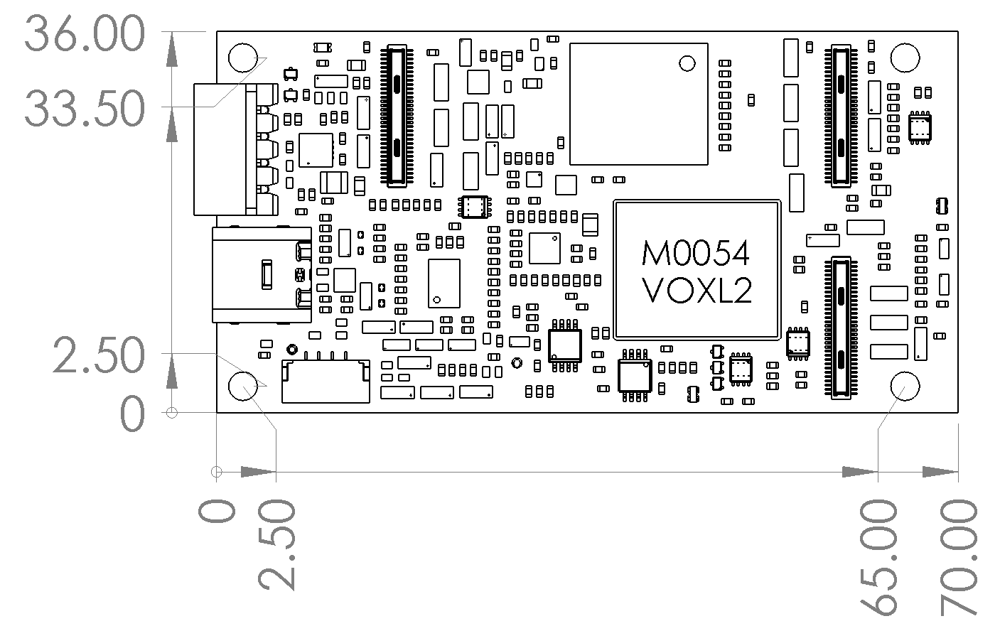

***Fan clearance reference.** Bottom-side outline, 70.0 × 36.0 mm. J2's location is in the connector figure above; confirm a 25 × 25 × 7 mm fan actually clears the frame before ordering — ModalAI/Livox documentation, retrieved 2026-10-09. Source: <https://docs.modalai.com/voxl2-mechanical-drawings/>*

The single most relevant data point in the entire cooling literature is a Starling 2 Max owner who measured **~104 °C CPU and ~98 °C GPU at 96 % CPU utilisation while sitting idle on a desk**, with `voxl-camera-server` at ~184 %, `voxl-qvio-server` at ~96 % and `px4` at ~90 %, and who was simultaneously seeing "Preflight Fail: High Accelerometer Bias" ([ModalAI forum, Questions on Starling 2 Max](https://forum.modalai.com/topic/5330/questions-on-starling-2-max.md)). ModalAI's Eric Katzfey replied the same day that the high temperatures **may be causing the accelerometer bias error** and recommended recalibrating the IMU with airflow over the unit. A desk fan dropped the board to ~80 °C. That is a flight-safety symptom, not a performance one, and it is the reason to take this seriously.

It is also the reason the cheapest fix is free. The board was not actually idle — it was running the full camera and VIO stack. **Your configuration already disables VIO**: `docs/CONFIG.md` and `docs/DRONE_SETUP.md` mandate `"en_vio": false` and `"offboard_mode": "off"` in `/etc/modalai/voxl-vision-hub.conf`, which removes the ~96 % `voxl-qvio-server` term from that profile outright. **Camera services are the remaining untrimmed load**, and they were the largest single consumer at 184 %. Your docs do not mention `voxl-camera-server` anywhere, so nothing in your stack has declared a dependency on it; under OptiTrack mocap neither VIO nor most camera pipelines are needed for navigation. ModalAI staff diagnosing a Starling 2 "idle" at >80 °C found the same thing — `voxl-portal` consuming CPU and `voxl-camera-server` "an excessive amount", with the board heating rapidly when voxl-portal was open in a browser ([ModalAI forum](https://forum.modalai.com/topic/4484/temperature-issue-with-voxl-2.md)). Never leave voxl-portal open during a session.

Against that, the thermal headroom is larger than the 104 °C figure suggests. ModalAI staff repeat that throttling begins "around 95 °C" and is "normal… it cannot run full speed indefinitely without turning down", and that 60–75 °C is unremarkable ([ModalAI forum, thermal throttling](https://forum.modalai.com/topic/5103/voxl2-thermal-throttling-and-heat-dissipation-methods); [ModalAI forum](https://forum.modalai.com/post/18723)). There is a residual 90-vs-95 °C discrepancy across staff posts, likely the difference between `voxl-cpu-monitor`'s warning flag (set above 90 °C — [ModalAI docs](https://docs.modalai.com/voxl-cpu-monitor-0_9/)) and the kernel trip point. **No Qualcomm QRB5165 thermal datasheet with Tj max or thermal resistance was locatable**, so you cannot compute a margin for 30 °C ambient analytically. The only defensible approach is to log it: `voxl-inspect-cpu -j -t` in a one-second loop redirected to a file, across a complete session from cold power-on through idle-on-floor, armed, hover, land and idle, **logging `scaling_cur_freq` per core alongside temperature** because hot-without-frequency-reduction needs no action.

If you do fit a fan, the hardware answer is settled and the control answer is not. ModalAI sells a 25 × 25 × 6.9 mm 5 V fan — Sunon **MC25060V1-000U-A99**, mating connector **SHR-02V-S**, ~3.0 CFM, ~5.0 g — that plugs into VOXL 2's **J2**, which is a purpose-built header: pin 1 is protected 5 V, pin 2 is a **PWM-controlled return limited to ~400 mA** ([ModalAI docs, thermal performance](https://docs.modalai.com/voxl2-thermal-performance/); [ModalAI forum](https://forum.modalai.com/topic/1271/cpu-overheating-on-voxl-2); [IBS Electronics](https://ibselectronics.com/products/sunon-fans/mc25060v1-000u-a99); [ModalAI docs, VOXL 2 Connectors](https://docs.modalai.com/voxl2-connectors/)). Use J2 and nothing else: J19 shares its 5 V with GNSS and the RC receiver, and the ESC main pads are the unregulated 16.8 V bus. **ModalAI explicitly has no heatsink recommendation for VOXL 2** and warns that a bare heatsink without airflow "will effectively become a large thermal capacitor"; if you add one, "be careful not to apply excessive mechanical stress to the QRB5165 SIP" ([ModalAI forum, topic 5103](https://forum.modalai.com/topic/5103/voxl2-thermal-throttling-and-heat-dissipation-methods); [ModalAI docs](https://docs.modalai.com/voxl2-thermal-performance/)). One user reported a 14 × 10 mm Raspberry Pi RAM heatsink on the underside of the SIP plus a fan gave "at least 10-20 degrees" under heavy load — the only quantified number available, and anecdotal. Aim air at the **memory side**: ModalAI placed the J3/J5 B2B connectors on the secondary side specifically so add-on boards would not block airflow over the LPDDR5, which "sits above the CPUs" and is the thermal bottleneck ([ModalAI forum, thermal management](https://forum.modalai.com/topic/2233/voxl2-thermal-management)).

Control is contradictory in the sources. `voxl-fan {on|slow|off}` exists and drives a 25 kHz PWM, and `voxl-cpu-monitor` is documented as adjusting the fan with temperature — but that page is marked legacy and tells you to use J6, which is a camera connector on VOXL 2, and 2022 forum replies say flatly "On VOXL2, the fan output is always on, and there is currently no way to control it" ([ModalAI docs, voxl-fan-control](https://docs.modalai.com/voxl-fan-control/); [ModalAI forum](https://forum.modalai.com/post/15692)). Verify with `which voxl-fan; voxl-fan off` on your SDK version. The recommendation is to leave the default behaviour alone: a constant-speed fan actually suits a flight controller better than a thermostatic one, because fixed RPM gives a single stationary vibration peak a static notch filter can remove, whereas a variable-speed fan sweeps the peak — *that is engineering inference, not a sourced finding*, as is the broader vibration argument, because **no source anywhere addresses cooling-fan vibration coupling into a flight-controller IMU on any platform**. Mount the fan to the frame on soft standoffs rather than to the board, secure the cable, and re-fly an identical hover profile comparing PX4 vibration metrics and raw-accel FFT with the fan on and off before trusting it. The decision order is: measure, cut load, re-measure, and only then fan. ModalAI's own measured experience is that **prop-wash routing beat high-end vapor chambers and heatsinks by "many degrees C"** ([ModalAI docs](https://docs.modalai.com/voxl2-thermal-performance/)), which means in hover the fan may add very little — its real value is the bench, pre-arm, between-flights and IMU-calibration phases, which is exactly when 104 °C was observed. A desk fan during development is free and already recommended by ModalAI staff for this airframe.

## Props are a 7-inch consumable OddityRC already stocks

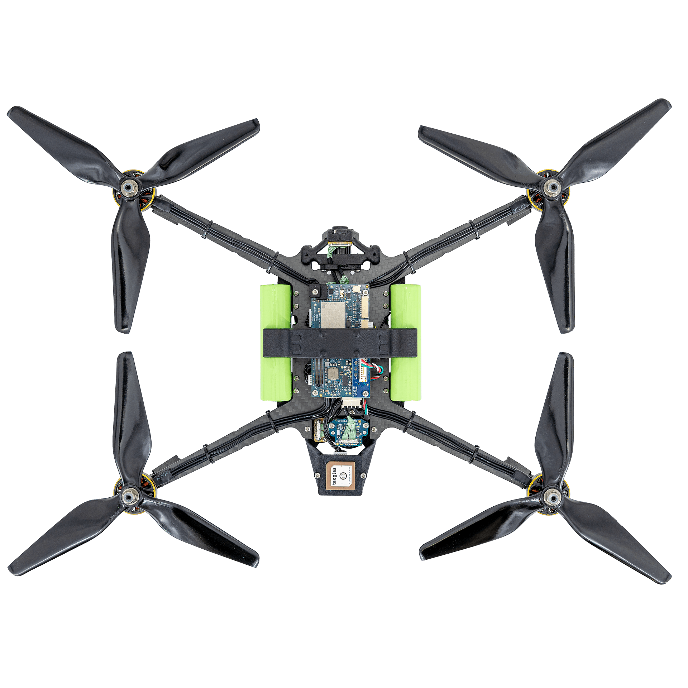

***Prop and motor layout.** Top-down view of the X-frame showing the four motor mounts and the tri-blade propeller arrangement — ModalAI/Livox documentation, retrieved 2026-10-09. Source: <https://www.modalai.com/products/starling-2-max (media position 7 in the product's Shopify media list)>*

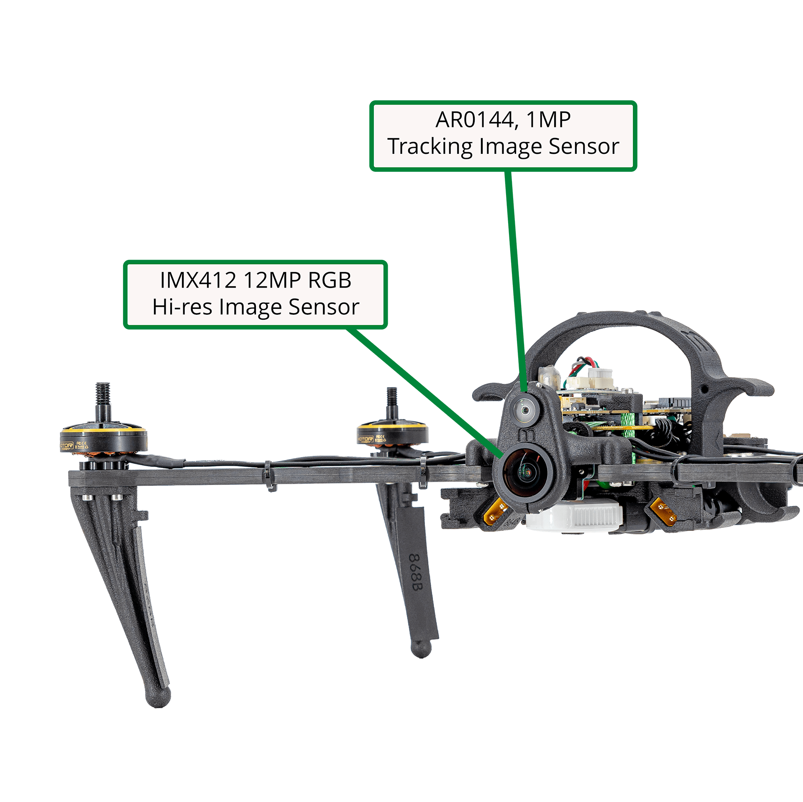

*ModalAI's own callouts for the IMX412 12 MP hi-res and AR0144 1 MP tracking sensors — the camera services that dominate the thermal load — ModalAI/Livox documentation, retrieved 2026-10-09. Source: <https://www.modalai.com/products/starling-2-max (media position 3)>*

ModalAI publishes almost nothing about the propeller. The datasheet says **"180 mm Tri-Blade"**, the hardware overview says **"180 mm folding propellers"**, and the store sells one SKU — **MRP-D0012-1-00, "Propellers, set of 4", US$29.99** ([ModalAI docs](https://docs.modalai.com/starling-2-max-datasheet/); [ModalAI docs](https://docs.modalai.com/starling-2-max-hardware-overview/); [ModalAI store](https://www.modalai.com/products/starling-2-max-replacement-parts)). **Pitch, bore, hub thickness, material, weight, CW/CCW convention and manufacturer are all unpublished**, and ModalAI's own docs contradict each other on whether the prop folds. The geometry does cross-check cleanly: 322 mm motor diagonal + 180 mm prop = the stated 512 mm prop-tip-to-prop-tip, so 180 mm really is the diameter — a **7.09-inch tri-blade**. The separate "Propeller Nuts" (M10001405) line item implies a threaded shaft with a nut rather than a press-fit.

The interesting engineering fact is that 2203.5/2204 stators at 1500 kV on 4S swinging 7" props is unusually small — Gemfan's own 7" listings recommend **2806.5 1350 kV or "2808 and up"**. ModalAI is deliberately running a low-load, efficiency-biased combination to hit 40–55 min endurance at 566 g. The consequence is blunt: **fitting a high-pitch or "freestyle" 7" prop is the most likely single way to cook the motors or ESC.** Do not go up in pitch from stock.

For replacements, **OddityRC is a Singapore-registered FPV store at 60 Paya Lebar Road #11-53 Paya Lebar Square with an order pickup point**, stocking four Gemfan 7-inch props: **7035-2 Long Range US$3.29, 7035-3 Freestyle US$3.49, 7037-3 Cinelifter US$3.49, Flash 7040-3 US$2.99** ([oddityrc.com](https://oddityrc.com/); [OddityRC 7" props](https://oddityrc.com/collections/7-props)). The 7037-3 publishes real specs: **178.8 mm diameter, 3.7" pitch, 8.7 g, M5 centre hole, 7 mm centre thickness, reinforced carbon nylon** ([OddityRC](https://oddityrc.com/products/gemfan-7037-3-carbon-nylon-for-cinelifter-macro-quad)). That is a ~US$3 prop against ModalAI's ~US$7.50 each. If your stock prop turns out to be a genuine folder, the closest analogue is the **Gemfan F7036 folding 3-blade — 177.8 mm, 3.6" pitch, 5 mm centre hole, 8.2 g, 7.25 mm centre thickness, aluminium hub, US$7.49/set** ([RaceDayQuads](https://racedayquads.com/products/gemfan-f7036-folding-3-blade-propeller-set-of-4-black)) — and **no Singapore source for a folding 7" was found**, so that would ship from the US or a marketplace seller. Note that OddityRC prices in USD and quotes "parts typically arrive in 5–8 days", which does not read like same-day local stock; email before relying on it for a same-week resupply.

**No source confirms any third-party prop as a correct substitute for MRP-D0012-1-00** — every recommendation above is dimensional reasoning, not a ModalAI endorsement. ModalAI's position on tuning is explicit and worth respecting: "There is no need to re-calibrate the ModalAI ESC if you use a stock configuration, such as the motor + propeller that comes with Starling 2 MAX", and "the ESC with the correct params is tuned for this motor + propeller… I do not recommend trying to fix this by modifying ESC parameters" ([ModalAI forum](https://forum.modalai.com/post/19806)). For anything that changes mass or configuration, staff point at the generic PX4 tuning guides and say "we do not offer any additional information on that topic" ([ModalAI forum, adding payload to max2](https://forum.modalai.com/topic/5272/adding-payload-to-max2.md)). A same-diameter, same-pitch, same-weight swap should fly on the stock tune; different pitch or weight moves `CA_ROTORn_CT` and `MPC_THR_HOVER` and the rate-loop gains. Because your EKF is fed OptiTrack position, **a prop-induced vibration problem will not show up as position drift first — it will show as climbing IMU vibration metrics, EKF innovation spikes and attitude-loop oscillation.** Log `VIBE` and `estimator_innovations` on the first flight after any prop change, and keep one set of genuine ModalAI props as the known-good reference.

The practical sourcing posture: props are a stocked consumable, not a just-in-time order. ModalAI quotes **60 business days** on a Starling 2 Max airframe ([ModalAI store](https://www.modalai.com/products/starling-2-max)), and spare props are not included in any kit.

## The Mid-360 is flyable and marginal; the compute path is unproven

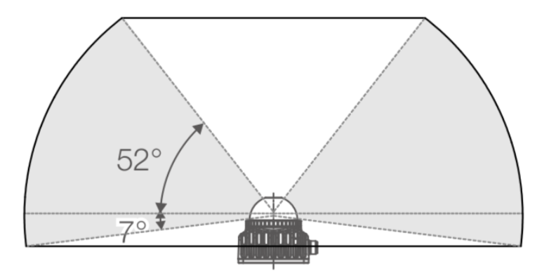

***The single most important picture for the mounting decision.** The Mid-360's vertical FOV is strongly asymmetric — it sees 52° *above* horizontal and only 7° below, with a blind cone directly overhead. Mounted upright on a mast it watches your hangar's roof trusses (feature-rich, good for LIO) while seeing almost nothing of the floor — ModalAI/Livox documentation, retrieved 2026-10-09. Source: <https://daystar.lenovo.com/docs/en/daystarBot/V2.4/SDKOverview/Services/LiDARServices.html>*

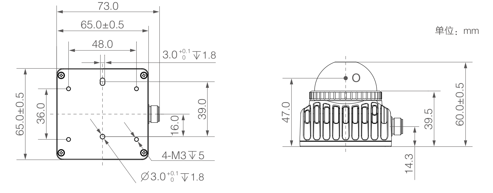

***Dimensions for the mast design.** 65.0 ± 0.5 mm square body, 73.0 mm across including the connector boss, 60.0 ± 0.5 mm tall — ModalAI/Livox documentation, retrieved 2026-10-09. Source: <https://daystar.lenovo.com/docs/en/daystarBot/V2.4/SDKOverview/Services/LiDARServices.html>*

***Point-cloud frame.** Origin and X/Y/Z axes — what the LiDAR-to-body extrinsic is measured against — ModalAI/Livox documentation, retrieved 2026-10-09. Source: <https://daystar.lenovo.com/docs/en/daystarBot/V2.4/SDKOverview/Services/LiDARServices.html>*

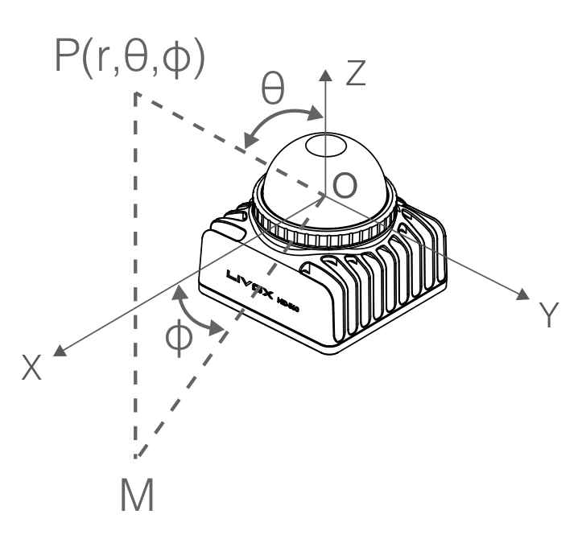

*Spherical convention for raw point data: range *r*, zenith *θ* from +Z, azimuth *φ* — ModalAI/Livox documentation, retrieved 2026-10-09. Source: <https://daystar.lenovo.com/docs/en/daystarBot/V2.4/SDKOverview/Services/LiDARServices.html>*

### Payload: 265 g of a 500 g budget, with nothing left over

The Livox Mid-360 is the only Livox unit plausibly carryable: **265 g, 65 × 65 × 60 mm, 6.5 W average, 9–27 V DC, 360° × (−7°…+52°) FOV, 0.1 m minimum range, 200,000 pts/s, IP67, built-in ICM40609 IMU, 100BASE-TX Ethernet, PTPv2 and GPS sync** ([Livox Mid-360 specs](https://www.livoxtech.com/mid-360/specs)). Every sibling is 2–4× heavier: Mid-70 580 g, Avia 498 g, HAP ~1120 g ([Livox Mid-70 specs](https://www.livoxtech.com/mid-70/specs); [Livox Avia specs](https://livoxtech.com/avia/specs); [Livox HAP specs](https://livoxtech.com/hap/specs)).

Against a stated **566 g takeoff weight and 500 g payload** ([ModalAI docs](https://docs.modalai.com/starling-2-max-datasheet/)), a realistic Mid-360 installation — sensor, shortened harness, damped mount plate, an Ethernet add-on, maybe a BEC — lands at roughly **375–500 g**, where everything except the sensor's 265 g is an unverified estimate because ModalAI and Livox publish no masses for the harness, the M0062 board or any mount. That fits the published capacity only at the low end of the estimates. ModalAI's Alex Kushleyev calls a **250 g** payload's ~50 % mass increase "quite substantial", and for 500 g says weight doubles so "in ideal world, the flight time will be cut in half" with the real loss worse because motor and battery efficiency degrade under 2× load ([ModalAI forum](https://forum.modalai.com/topic/5272/adding-payload-to-max2)). Modelling hover power as roughly W^1.5 on a 43 Wh 4S pack gives **~12–18 minutes against 40 minutes stock** — *a calculation from published figures, not a measured or ModalAI number*. Note the datasheet does not reconcile its own arithmetic: 566 + 500 = 1066 g, but it describes the payload case as "total takeoff weight ~930 g".

**The honest conclusion is that the Mid-360 consumes essentially the entire payload budget and leaves no margin for a companion computer.** If the VOXL 2 cannot run the LIO stack and a Pi 5 or Orin Nano class board (60–250 g plus 5–25 W) becomes necessary, the aircraft is over budget and the correct answer is "not on this airframe". That is the pivotal risk in this workstream, and it should be resolved — by measuring VOXL 2 CPU headroom — before any hardware is bought. Lighter alternatives exist and deserve a look: the **Hesai JT16 at under 200 g and 4.3 W** ([Hesai JT16](https://www.hesaitech.com/product/jt16/)) and the **Unitree 4D LiDAR L1 at ~230 g and 6 W with a symmetric 360° × 90° FOV** ([Generation Robots](https://generationrobots.com/en/404133-unitree-4d-lidar-l1.html)), whose hemispherical coverage suits indoor flight better than the Mid-360's upward-biased −7°/+52°. Both trade away the mature Livox/FAST-LIO toolchain.

Power is the easy part: the Mid-360's **9–27 V input spans the 4S rail directly**, so tee an XT30 off the battery or the ESC power module's pass-through with a 1–2 A inline fuse, and **never** power it from a VOXL 2 5 V rail (6.5 W at 5 V is 1.3 A against a 1 A per-connector rating) ([Livox Mid-360 specs](https://www.livoxtech.com/mid-360/specs); [VOXL 2 connectors](https://docs.modalai.com/voxl2-connectors/)). Livox publishes no Mid-360 inrush figure; siblings show roughly 2× at startup, so power the sensor after VOXL 2 has booted past its own 6 A inrush. Mechanically, a **top-centre mast** is the only viable location — the sensor is 60 mm tall and the aircraft lands on its underside — and ModalAI advises keeping added mass "as close as possible to the geometrical center" ([ModalAI forum](https://forum.modalai.com/topic/5272/adding-payload-to-max2)). 265 g at 80–100 mm above the existing CG raises the pitch/roll inertia substantially, which reads as sluggish attitude response and lower achievable rate-loop gains. Resist the urge to soft-mount it: **265 g on a compliant mount atop a tall mast is a pendulum whose rocking mode may sit in the 5–15 Hz band, squarely inside a small quad's attitude bandwidth** — the classic cause of "it flies fine until you push the gains". Start stiff, measure the Mid-360's own IMU spectrum, and add short stiff-in-shear damping only if it saturates. *That resonance reasoning is inference from standard multirotor practice; no quantitative study of Mid-360 IMU noise on a multirotor was found.*

### Interface: the VOXL 2 has no Ethernet, and nobody has done this

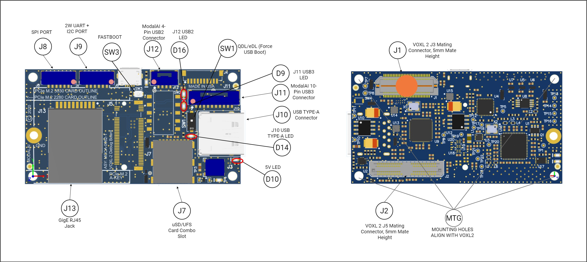

***The add-on the LiDAR would need.** M0062 Ethernet Expansion + USB Hub, annotated — J13 is the GigE RJ45 jack. Note it is not listed as Starling 2 Max-compatible, and no one has confirmed it working with a Mid-360 — ModalAI/Livox documentation, retrieved 2026-10-09. Source: <https://docs.modalai.com/m0062-datasheet/>*

The Mid-360 is ordinary 100BASE-TX over an M12 12-pin to RJ45 + power breakout, which is good news — no automotive-Ethernet media converter. But **the VOXL 2 has no native Ethernet port and no exposed MAC** ([VOXL 2 connectors](https://docs.modalai.com/voxl2-connectors/)). The sanctioned path is the **M0062 "VOXL 2 Ethernet and USB Hub Add-on", US$259.99**, which plugs into J3/J5 and enumerates as `eth0` ([ModalAI M0062-2](https://www.modalai.com/collections/expansion-board/products/m0062-2); [M0062-2 docs](https://docs.modalai.com/m0062-2/)). ModalAI staff describe it as a **USB-to-Ethernet bridge** limited to a **USB2 backhaul**, with integrated-magnetics RJ45s that are "more vulnerable to shock failure than typical RJ45's" ([forum.modalai.com](https://forum.modalai.com/topic/2944/datasheet-for-voxl2-ethernet-expansion-and-usb-hub-addon.md)). Users have reported dead and intermittent units, the board has **no link LEDs**, and its Type-A port J10 "is not working consistently… for USB3 speeds" ([forum](https://forum.modalai.com/topic/3844/add-on-ethernet-hat-eth0-rj45-port-not-creating-a-network-connection.md); [M0062 user guide](https://docs.modalai.com/m0062-user-guide/)). Bandwidth is not the problem — 200k pts/s × 14 B/pt works out to **~24 Mbit/s on the wire**, trivial for USB2 ([Livox Mid-360 Ethernet protocol](https://livox-wiki-en.readthedocs.io/en/latest/tutorials/new_product/mid360/livox_eth_protocol_mid360.html)).

The precedent problem is more serious than the hardware problem. **ModalAI staff have twice stated they have no experience with this sensor.** Eric Katzfey: "We have no experience with this sensor", adding that ModalAI uses time-of-flight indoors, stereo outdoors and single-point LiDAR for height ([forum.modalai.com thread 4196](https://forum.modalai.com/topic/4196/clarification-on-livox-mid-360-lidar-compatibility-with-voxl-2-on-starling-2-max-outdoor-drone.md)). A second thread got "if you use an ethernet to USB adapter, you should be able to get a network connection" ([forum.modalai.com thread 4660](https://forum.modalai.com/topic/4660/integrating-lidar-sensor)). Both threads end without a confirmed working integration, and **there is no ModalAI-supported LiDAR driver in the VOXL SDK or MPA at all**. Budget serious bring-up time; you will be first.

Time sync is less frightening than it looks. The Mid-360 supports **PTPv2, gPTP and GPS/PPS**, auto-syncs to any PTP master on the network, and sets `timestamp_type = 1` when synced ([Livox time sync](https://livox-wiki-en.readthedocs.io/en/latest/tutorials/new_product/common/time_sync.html)). Indoors there is no GPS, so the VOXL 2 becomes grandmaster over a USB-Ethernet link that almost certainly cannot do hardware timestamping — software PTP at tens of microseconds to milliseconds. That is fine, because the tightest requirement (LiDAR points to the sensor's own IMU) is solved **inside** the sensor, and LI-Init estimates the residual offset anyway. What PTP buys here is a common epoch, not sub-microsecond alignment.

### Software: FAST-LIO2 on paper, with a real ROS 1/Foxy/Jazzy problem

`livox_ros_driver2` officially builds on **ROS 2 Foxy, Humble and Jazzy** from the same tree ([livox_ros_driver2 README](https://raw.githubusercontent.com/Livox-SDK/livox_ros_driver2/master/README.md)), so the Foxy-onboard/Jazzy-ground split is **not** a driver-availability problem — it is a DDS interoperability problem, which your repo's existing convention of speaking plain UDP for onboard add-ons already sidesteps. Upstream does caution that the driver is "limited to test scenarios" and not recommended for mass production.

FAST-LIO2 is the right default algorithm. It is the only candidate with **published ARM benchmarks** — on a Khadas VIM3 (4× Cortex-A73 @ 2.2 GHz) it averages **45–66 ms/scan on Livox Horizon data** and the authors state it "can also achieve 10 Hz real-time performance" on ARM ([FAST-LIO2 paper](https://ar5iv.labs.arxiv.org/html/2107.06829)). Scaling to the QRB5165's newer ~3 GHz cores suggests ~20–65 ms/scan — fits a 10 Hz budget, but not with the headroom you want while PX4, MPA and the camera pipelines also run. **That is extrapolation, not measurement, and the gating unknown is VOXL 2 CPU headroom, which nobody has published.** FAST-LIO2 has no loop closure, which is a *feature* here: loop-closure corrections produce pose steps that PX4's EKF handles badly. GLIM is more accurate and natively ROS 2 Humble/Jazzy but "required GPU acceleration for real-time processing" in an independent benchmark ([arXiv:2505.01017](https://arxiv.org/pdf/2505.01017)), which pushes it toward a Jetson companion. Point-LIO is ROS 1 only and **does not name the Mid-360** in its supported Livox list ([Point-LIO GitHub](https://github.com/hku-mars/Point-LIO)). The real decision driver is that FAST-LIO2 and Point-LIO are ROS 1 catkin projects while the only ROS 2-native option wants a GPU and Ubuntu 22.04+, which **VOXL 2 cannot run** — ModalAI staff say "it is not possible to update to Ubuntu 22.04 on the VOXL 2 autopilot" ([forum.modalai.com](https://forum.modalai.com/topic/2664/sentinel-voxl2-update-ubuntu-from-18-04-to-20-04.md)).

On the PX4 side the constraint is sharp: **EKF2 in v1.14 subscribes to exactly one external-vision topic, `vehicle_visual_odometry`**, and `vehicle_mocap_odometry` exists as a topic name but is not read by EKF2 ([PX4 v1.14.0 EKF2.hpp](https://github.com/PX4/PX4-Autopilot/blob/v1.14.0/src/modules/ekf2/EKF2.hpp); [PX4 v1.14 external position estimation](https://docs.px4.io/v1.14/en/ros/external_position_estimation.html)). Mocap and SLAM cannot be fused — they contend for one channel, and arbitration has to live outside PX4. Your `EKF2_EV_CTRL=11` decodes as horizontal position + vertical position + yaw with 3D velocity off, correct for a pose-only mocap feed; a SLAM source that supplies velocity opens up `15`. Your `EKF2_EV_DELAY=50` must be **re-measured, not inherited** — an onboard FAST-LIO2 pipeline plausibly runs 70–130 ms end to end, dominated by scan accumulation, which the driver's `publish_freq` directly controls. Two cheap safety wins come free with SLAM that mocap never offered: with `EKF2_EV_NOISE_MD=0` (the default) the EKF honours the message's own `position_variance`, so a degeneracy-aware SLAM node can tell PX4 "I know Y, I don't know X"; and `EKF2_EV_QMIN` plus the `quality` field is the designed-in hook for making PX4 itself stop fusing a sick solution ([PX4 v1.14.0 ekf2_params.c](https://github.com/PX4/PX4-Autopilot/blob/v1.14.0/src/modules/ekf2/ekf2_params.c)). A SLAM bridge **must** also increment `reset_counter` on any pose discontinuity.

Degeneracy is the failure mode to design for, and an indoor hangar is close to the worst case. The literature's canonical bad environments are "corridors or open fields" ([D²-LIO, arXiv:2508.14355](https://arxiv.org/pdf/2508.14355)), and a hangar combines both: translation parallel to a long blank wall is weakly constrained, and in the middle of a large volume the Mid-360's 40 m @ 10 % reflectivity may not reach anything structured. The cheapest mitigation is environmental — **put boxes, pillars and equipment in the volume to break translational symmetry.** The detection metric is already in the literature: the minimum eigenvalue of the registration Hessian falls as geometric constraint is lost ([KNS tunnel study](https://www.kns.org/files/pre_paper/55/26S-497-심수곤.pdf)), and FAST-LIO2 forms that Hessian internally — though **whether it exposes the eigenvalues without a source patch was not verified**. And note what happens if EV stops: with your `EKF2_GPS_CTRL=0` and `EKF2_BARO_CTRL=0`, the estimator has **nothing left**. SLAM's distinctive hazard versus mocap is that it can be confidently wrong — drifting smoothly while the aircraft holds a position that is slowly moving — which makes your existing iron rules more important, not less.

Inside AirStack the integration is unusually clean, and it is **one launch argument, not a code change**. The canonical odometry topic is **not** `/{robot_name}/odometry` — that is an explicitly-labelled v2 target — it is **`/{robot_name}/odometry_conversion/odometry`**, and every consumer (PID, DROAN, random_walk, trajectory controller, task servers, safety monitor) subscribes there ([Interface Conventions Specification](https://raw.githubusercontent.com/castacks/AirStack/main/docs/robot/autonomy/interface_conventions.md)). The documented path is to publish `nav_msgs/Odometry` (RELIABLE, pose in `map` ENU, twist in body frame) on `perception/<your_estimator>/odometry` and route it through the existing `odometry_conversion` node by setting `interface_odometry_in_topic` ([adding_a_state_estimator.md](https://raw.githubusercontent.com/castacks/AirStack/main/docs/robot/autonomy/perception/adding_a_state_estimator.md)) — which also buys you the `map → base_link` TF broadcast. Your branch already vendors `macvo_ros2`, the precedent estimator, in exactly the slot a LIO node would occupy. **You need both injection points**, though: the AirStack-side rewire for planning, and the PX4-side external-vision path (the commented-out `visual_odometry_in` remap in `px4_interface.launch.xml`) so PX4 can hold position at all. Three undesigned areas remain: **TF ownership** (AirStack publishes `world → map` statically and `odometry_conversion` publishes `map → base_link`; a SLAM package wanting `map → odom → base_link` will collide, and nothing documents the reconciliation); **LiDAR-driven local avoidance** (DROAN is fundamentally a disparity planner, and upstream admits "there isn't a spec-level" local world-model contract — the CPU planner's `cost_map_interface` pluginlib seam is the smallest honest path, but its README is empty in your tree); and the **Foxy-vs-Jazzy question**, where AirStack lists VOXL 2 as supported and gives it a `voxl` compose profile but no document addresses the distro mismatch, implying AirStack runs its own Jazzy container on the board. That last one is unverified and important. Note also that `docs/robot/autonomy_modes.md` states **"VOXL2 always runs in onboard-only (lite) mode — it does not have sufficient compute for global planning"**, and odometry is marked "produced onboard" in the spec — so AirStack's own rules put SLAM on a board it already describes as compute-limited.

The right sequence costs almost nothing to start: mount the sensor (or carry it by hand with the same mocap markers), record synchronised Livox + OptiTrack bags, run FAST-LIO2 offline on a workstation and compute ATE against mocap. **Your mocap volume is a near-ideal SLAM validation rig, and it is worth more as an independent scorer than as a second input.** Then run SLAM live in shadow mode for weeks, publishing nowhere near PX4, building a record of drift rate, yaw-rotation behaviour and recovery after occlusion. Measure true end-to-end latency by cross-correlating SLAM against mocap position during sharp lateral manoeuvres — that lag *is* `EKF2_EV_DELAY`, measured directly with no EKF in the loop, and it is strictly better than PX4's documented innovation-minimisation search. Only then do a props-off bench cutover. *This staged plan is engineering judgement; no published procedure for mocap-validated SLAM cutover on PX4 was found.*

## AirStack already carries the LiDAR path; pose and local avoidance are the gaps

Invert the mental model you probably started with. A complete LiDAR chain is already wired and already the default **in the tree you fly**: Isaac Sim's RTX Ouster OS1 publishes to `sensors/ouster/point_cloud_raw`, `lidar_point_cloud_filter` cleans it onto `sensors/ouster/point_cloud`, and `vdb_mapping_ros2` consumes that as its only active source — `global_bringup/config/vdb_params.yaml` reads `sources: [lidar]` with `topic: sensors/ouster/point_cloud`, `sensor_origin_frame: ouster`, and the stereo block commented out beneath it. `random_walk_planner` reads the result, and `exploration_planner` is in the tree remapping `sensor_pointcloud` directly to `/$(env ROBOT_NAME)/sensors/ouster/point_cloud` — though no bringup package actually launches it, so treat it as available rather than running. `tests/conftest.py` sets `ENABLE_LIDAR=true` and the `sensors` mark probes those topics — but that coverage is conditional, skipping entirely unless `SIM_TYPE` is `isaacsim`, and it touches only the filter chain: nothing in `tests/` exercises `vdb_mapping`, the planners, or `odometry_conversion`. **LiDAR → map → global planning is solved and shipped. What is unsolved is LiDAR → pose and LiDAR → local obstacle avoidance** — and only the first of those is on your roadmap.

The sensors layer is a normalization layer, not a driver layer, and AirStack vendors no LiDAR driver at all — not in your branch, not upstream. So a real Livox install is three artifacts, not one package: the vendor driver (`livox_ros_driver2`, yours to supply) publishing raw points; a thin sensor-layer package or a pure remap putting them on `sensors/ouster/point_cloud_raw`; and a URDF link plus fixed joint giving the cloud a TF frame, the way `iris_with_sensors.pegasus.robot.urdf` already defines `base_link_body_to_lidar_mount` → `lidar_mount` → `ouster`. Because the interface spec already blesses `sensors/ouster/point_cloud` and the generic `sensors/lidar/point_cloud`, a LiDAR that lands on either name needs **zero** downstream changes. Two conventions bite silently if missed: topics in config files must be absolute (`/$(env ROBOT_NAME)/sensors/...`) or they resolve under the node's own namespace, and the launch file must load that YAML with `allow_substs="true"` or `$(env ROBOT_NAME)` is passed through as a literal string. QoS mismatch is the third: a best-effort subscriber under a reliable-only publisher receives nothing, with no error anywhere.

**The canonical odometry topic is not what AirStack's own `AGENTS.md` says it is.** That table advertises `/{robot_name}/odometry`; the [Interface Conventions Specification](https://raw.githubusercontent.com/castacks/AirStack/main/docs/robot/autonomy/interface_conventions.md) states plainly that plain `odometry` is a **v2 target** which does not exist yet, and that every real consumer — safety monitor, PID, DROAN, `random_walk`, trajectory controller, task servers — subscribes to **`odometry_conversion/odometry`**. Your `local_bringup/launch/local.launch.xml` confirms it, defaulting `local_odometry_in_topic` to `/$(env ROBOT_NAME)/odometry_conversion/odometry` and remapping it into four nodes. The good news is what that buys you — with one caveat that matters for your rig: adding a SLAM pose source is **one launch argument on the MAVROS path**, but `interface_odometry_in_topic` exists only in `interface_bringup/launch/interface.launch.py`. The PX4/uXRCE-DDS path you actually fly hardcodes the remap in `px4_interface.launch.xml` and `drone_interface.launch.xml`, so there it is a small launch-file edit rather than an argument. Publish `nav_msgs/Odometry` (RELIABLE, pose in `map` as ENU metres, twist in body frame) on `perception/<your_estimator>/odometry`, then point `odometry_conversion`'s `odometry_in` at it — via `interface_odometry_in_topic` on the MAVROS path, or by editing the remap on the PX4 path. `odometry_conversion` restamps the frames and broadcasts `map → base_link` for free. Upstream warns explicitly against bypassing it: do so and you must publish that TF yourself, and fork `interface.launch.py` to avoid two publishers on one surface. The precedent is already vendored in your tree — `perception/macvo_ros2/` is a learned stereo VO estimator sitting in exactly the slot a LIO node would occupy, launched behind `<arg name="launch_macvo" default="false"/>`.

There are **two injection points and you need both**, which no document spells out. The one above feeds the AirStack autonomy graph. The other feeds PX4's own EKF2, and your `px4_interface.launch.xml` already contains the seam, commented out: `<!-- <remap from="visual_odometry_in" to="/$(env ROBOT_NAME)/vio/odometry" /> -->` under "Visual odometry input: optional, remap to your VIO source". PX4 needs a pose to hold position at all; AirStack needs one to plan against. Replacing mocap means wiring both, and your existing mocap bridge already occupies the PX4-side seam — which is precisely why the mocap-as-scorer approach works: you can drive the AirStack side from SLAM while PX4 still flies on mocap, and compare.

**AirStack's own rules put SLAM onboard, on the board its docs call too weak for global planning.** `AUTONOMY_ROLE` dispatches three ways, implemented by setting per-layer `<arg name="X_package">` to the empty string to disable a layer. The cut is always in the same place: global planning is the only layer that may move offboard, and `docs/robot/autonomy_modes.md` states that the **VOXL2 profile is always `onboard`** because "it does not have sufficient compute for global planning". Perception is in the onboard set in every role, and the spec marks odometry "produced onboard" — the stated rationale being that link loss must leave the robot able to failsafe with no ground host in the loop. So the ground-station-SLAM architecture is not merely awkward, it is something AirStack explicitly argues against, and implementing it means hand-editing `dds_router`/`domain_bridge` configs. This sharpens the compute measurement in check 12: the VOXL 2 would be carrying interface, sensors, perception, local planning and behavior **plus** FAST-LIO2.

Local obstacle avoidance from LiDAR is the one genuinely hard integration, and you can defer it. DROAN is a disparity-space planner by construction, and the variant your branch actually runs — `droan_gl` — does its obstacle expansion in OpenGL shaders on stereo disparity frames with no plugin seam at all; the CPU `droan_local_planner` block in `local.launch.xml` is disabled behind `<?ignore ?>`. Upstream is candid that the local world-model ↔ planner interface is **not** a spec'd interchange: "a local planner and its world model are a matched pair". The one blessed extension is that the CPU planner loads its obstacle representation as a pluginlib `cost_map_interface` plugin selected by its `cost_map` parameter, so a VDB-backed plugin plus re-enabling that planner is the smallest honest path — though `cost_map_interface/README.md` is **empty** in your tree and the API a plugin must implement is undocumented. Upstream's own answer is to replace DROAN with the `mighty` module, but it declares compatibility `>=0.20.0-alpha.16 <0.21.0` against the stacks-and-modules AirStack your branch is not.

Develop the whole thing in simulation first — the plumbing, at least. `ENABLE_LIDAR=true` spawns an RTX OmniLidar with real Ouster OS1/OS0/OS2 and Velodyne VLP16 profiles via Pegasus's `spawn_rtx_lidar.py`, publishing onto the canonical raw topic, and `.agents/skills/test-in-simulation` and `write-isaac-sim-scene` document the workflow. Sim will prove topic names, QoS, TF, frame conventions and that the `interface_odometry_in_topic` rewiring works, all without hardware. It will tell you **nothing about drift**: Pegasus and PX4 SITL supply ground-truth-derived odometry, so a SLAM node in sim competes against a perfect estimate, and deliberately degrading that pose to make the test meaningful is undocumented. Drift evaluation is what your mocap volume is for. One upstream asset worth knowing about if you go further: the `asm_optitrack` module ships a Motive-compatible NatNet server emulator for Isaac Sim, meaning upstream already simulates your exact mocap rig.

Two caveats on all of the above. First, **branch currency**: your `yikuan/SVG_ground_control` snapshot predates upstream's stacks-and-modules refactor, so every upstream CLI verb in their guides (`airstack stack new`, `airstack module add`, `airstack doctor`, `airstack test -m wiring`) is absent from your tree — the conventions transfer, the tooling does not, and the upstream guide `adding_a_state_estimator.md` does not exist locally at all (your `mkdocs.yml:113` still points at a renamed page). Second, **TF ownership is undesigned territory**: `robot.launch.xml` unconditionally publishes a static `world → map`, `odometry_conversion` broadcasts `map → base_link`, and most SLAM packages want to publish `map → odom` themselves. Nothing in either tree says who should own what, and a SLAM node that publishes its own tree will collide. That is a decision you will be making, not following.

## Singapore adds 9 % GST, no ModalAI distributor and no Livox dealer

Three procurement facts shape everything. First, **there is no ModalAI APAC distributor** — targeted searches returned nothing — and ModalAI ships direct from San Diego in USD, with most catalogue items quoted at ~10 business days and the airframe at 60 ([ModalAI contact](https://www.modalai.com/pages/beta-contact-us); [ModalAI store](https://www.modalai.com/products/starling-2-max)). Critically, the replacement-parts page states **"Each order ships the selected part only"**, which means five different spares generate five shipments and five sets of international freight. Consolidate. Second, **everything ModalAI sells here is ECCN EAR99, HTS 8807.30 / 8806.22.0000, origin USA** ([ModalAI store](https://www.modalai.com/products/starling-2-max-replacement-parts)) — not ITAR, not on the Commerce Control List, so a shipment to a Singapore civil research lab is an ordinary commercial export ([Shipping Solutions](https://shippingsolutionssoftware.com/blog/ear99-isnt-a-free-pass-for-export-compliance)). Expect a routine end-use question and nothing more. Third, **9 % GST applies to essentially every import with no useful de-minimis** since the Low-Value Goods regime took effect (8 % from 1 Jan 2023, 9 % from 1 Jan 2024, applying to goods ≤ S$400 from GST-registered overseas suppliers) ([Sovos](https://sovos.com/en-gb/blog/vat/singapore-updates-low-value-goods-gst-policy)); above S$400 it is collected at clearance instead, usually with a courier handling fee ([Passport Global](https://passportglobal.com/blog/2023-singapore-import-tax-changes)). Three secondary sources contradict each other on whether the S$400 threshold is computed on CIF or goods value; IRAS is the authority and was not retrieved.

On export control the asymmetry matters. Singapore's **Strategic Goods (Control) Act does not regulate importation** — the Regulation of Imports and Exports Act applies and a general TradeNet permit is needed before importing a strategic good ([Singapore Customs](https://www.customs.gov.sg/permits-and-licences/trade-controls-and-prohibitions/strategic-goods-control/)). The SGCA regulates **export, transhipment, transit, intangible technology transfer and brokering**, and since May 2019 transhipment exemptions were removed for specific codes under "sensors and lasers", "navigation and avionics" and "aerospace and propulsion". Enforcement is real: **Hydronav Services (Singapore) was fined S$1,133,412.25** for two counts of exporting strategic goods without permits ([WorldECR](https://www.worldecr.com/?p=2027273)). Importing a Livox for use in Singapore does not trigger this; **shipping a LiDAR-equipped aircraft out of Singapore might**, and whether a specific Livox falls under a controlled sensors-and-lasers code was not determined. That is a question for a control-code lookup before any conference demo travels. Separately, **no CAAS rule covering import or purchase of drone spare parts or LiDAR was found** — but no CAAS page confirming the absence was retrievable either, so treat that as unverified rather than a clean no.

Livox itself is the weakest-sourced corner of this research. **No authorised Singapore distributor was found and no SGD price exists anywhere**; livoxtech.com/dealer returns 404. The nearest named regional channel is **Optimus Control Industry in Kuala Lumpur** ([optimuscontrol.com](https://www.optimuscontrol.com/showproducts/productid/5854251/cid/544490/livox-mid40-mid70-mid360-compact-3d-lidar-sensor/)). Overseas resellers put the unit at **US$852–899** (Sonny Robotics US$852 at 1–2 weeks; Robotics Center US$899 on backorder; Robotopian lists Singapore among its shipping destinations with a "contact us to confirm availability" caveat) against a Livox list reference of US$979 ([sonnyrobotics.com](https://sonnyrobotics.com/products/livox-mid-360); [roboticscenter.ai](https://www.roboticscenter.ai/ar/store/product/livox-dji-livox-mid-360); [robotopian.com](https://robotopian.com/collections/livox-lidar); [livoxtech.com](https://www.livoxtech.com/news/mid360_launch)). Budget roughly **S$1,100–1,300 before freight and GST**. One timing note: a reseller states "the original Livox MID-360 LiDAR is being phased out and stock may be limited", pushing the **MID-360S**, and a cheaper half-point-rate **MID-360L** has been announced ([robotopian.com](https://robotopian.com/collections/livox-lidar); [DroneXL](https://dronexl.co/2026/09/21/livox-mid-360l-lidar-half-point-rate-robots/)). Since the 360L drops multicast support and the 360S arrived in `livox_ros_driver2` 1.2.6, confirm driver and FAST-LIO2 compatibility for whichever variant you actually buy. Three leads worth pursuing directly: Livox at cs@livoxtech.com asking for the Singapore partner, Optimus Control in KL, and DJI Enterprise's Singapore dealer list.

## What you must physically check on the hardware

Every workstream independently concluded that specific decisions cannot be made from documentation. These are the checks, grouped by what they unblock.

| # | Check | Method | Unblocks |
|---|---|---|---|
| 1 | Board part number, dash revision, SKU on each aircraft | `voxl-version` and `voxl-version -j`; `cat /sys/module/voxl_platform_mod/parameters/{machine,variant}` | Everything — firmware, camera count, support requests |
| 2 | Which WiFi hardware each aircraft carries | `ip -br link`; `lsusb`; `dmesg \| grep -iE 'wlan\|mlan\|rtl88\|mwifiex'`; `readlink /sys/class/net/mlan0/device/driver` | Confirms accessory-not-board difference; settles the Sparrow chipset question |
| 3 | WiFi daughterboard identity | Open the top plate, read the silkscreen on the board mating to VOXL 2 J3; look for `M0213`, `M0141` or `SP-01-100` on a 22×22 mm LGA can | Spares, antenna work, documentation accuracy |
| 4 | **Airframe revision: V1–V3 vs V4** | Motor colour (black-and-gold 2203.5 = V1–V3; black 2204 = V4) and motor-mount spacing | Frame and motor spare SKUs — **the frames are not interchangeable** |
| 5 | **Which ESC is fitted** | Read the silkscreen: M0129-5/-65 or M0138 | Resolves the conflict with `svg_led_daemon.py:62`; decides which ESC datasheet governs |
| 6 | **Voltage on the ESC ➕ LED test point** | Multimeter, vehicle powered | Decides whether the LED build needs a level shifter and a BEC, or neither |
| 7 | Which pad is the NeoPixel data test point (⬇), and whether it is reachable | Visual inspection with the vehicle partly disassembled | Whether the LED fit is a 30-minute job or a teardown |
| 8 | Whether the ESC LED rail is an independent regulator | Trace from the datasheet + continuity check | The Mini ESC also powers VOXL 2 — brown-out risk |
| 9 | Measured strip weight and measured current at operating brightness | Kitchen scale; inline ammeter | **No reliable published weight-per-metre exists for these strips** |
| 10 | **Baseline thermal profile across a full session** | `while true; do echo -n "$(date -Is) "; voxl-inspect-cpu -j -t; sleep 1; done >> /data/thermal_$(date +%F_%H%M).jsonl`, plus hangar ambient | The single measurement that decides whether a fan is needed at all |
| 11 | Throttling vs merely hot | Log `/sys/devices/system/cpu/cpu*/cpufreq/scaling_cur_freq` alongside temperature | Hot without frequency reduction = no action |
| 12 | What is actually consuming CPU | `voxl-inspect-cpu -f` or `top` during hover; compare against camera-server 184 % / QVIO 96 % / px4 90 % | **Also the gating measurement for whether onboard FAST-LIO2 is feasible** |
| 13 | Is J2 reachable, and is there clearance for a 25 × 25 × 7 mm fan over the memory side? | Visual; one older forum report claims a frame screw sits over the fan connector on the original Starling | Whether the sanctioned fan can be fitted at all |
| 14 | Does `voxl-fan` exist and work on this SDK? | `which voxl-fan; voxl-fan --help; voxl-fan off`; `ls /sys/class/pwm/` | Fan control strategy |
| 15 | Thermal zones and kernel trip points | `for z in /sys/class/thermal/thermal_zone*; do echo "$z $(cat $z/type) $(cat $z/temp)"; done; cat $z/trip_point_*_temp` | Resolves the 90 vs 95 °C ambiguity definitively |
| 16 | Does voxl-px4 stream `ONBOARD_COMPUTER_STATUS`? | QGC MAVLink Inspector | If yes, temperature is already in telemetry; no custom logging needed |
| 17 | **Read the moulding on the prop hub** | Gemfan/HQProp/Dalprop mould the size code (e.g. "7035-3", "F7036") into the hub | Likely identifies the OEM part and resolves the unpublished pitch |
| 18 | **Is the prop folding or one-piece?** | Visual — ModalAI's own docs contradict each other | Changes which third-party parts are candidates |
| 19 | Motor shaft diameter / prop bore, hub centre thickness, prop weight | Calipers and scale; expected M5, ~7 mm, 8–9 g, all unconfirmed | Third-party prop compatibility; prop-nut thread engagement |
| 20 | Clearance and structure for a top-centre LiDAR mast above the prop disc | Measure against the 512 mm diagonal and 120 mm airframe height | Whether a Mid-360 can be mounted at all |

## Conclusion

The structure of this brief is clearer than it first appears: four of the five workstreams are small, bounded and cheap, and one is a research project with a payload problem that may not have a solution on this airframe. LEDs, cooling and props together cost well under S$200 and a few bench hours, and the dominant risk in each is not technical difficulty but acting on a documentation assumption that physical inspection would have overturned — the ESC part number, the LED pad voltage, the prop pitch, the airframe revision. The pattern is consistent enough to be a policy: **on this platform, ModalAI's published documentation lags its hardware by at least one revision, and the forum is a better source than the docs.** Your own repo already carries one artefact of that lag (the M0138 comment) and your `mlan0` observation is another — the docs have not caught up to hardware you already own.

The LiDAR decision should be sequenced around a single measurement rather than a purchase. Run check 12 first: if the VOXL 2, with VIO already off and camera services trimmed, shows the headroom to carry FAST-LIO2 at 10 Hz alongside PX4, the Mid-360 fits the payload budget and the project is hard but viable. If it does not, a companion computer pushes the aircraft over budget and the right answer is a lighter sensor, a different airframe, or a ground-tethered bench rig — and **that answer is cheaper to discover from a `top` output than from a S$1,300 sensor sitting in a drawer.** Meanwhile the asset most people in your position lack, you already have: a calibrated mocap volume is a better SLAM scorer than it is a SLAM replacement, and it stays valuable long after LIO works. Its highest-value use is not as the thing you are trying to get rid of, but as the independent ground truth that tells you, flight by flight, exactly how far your new estimator has drifted.
